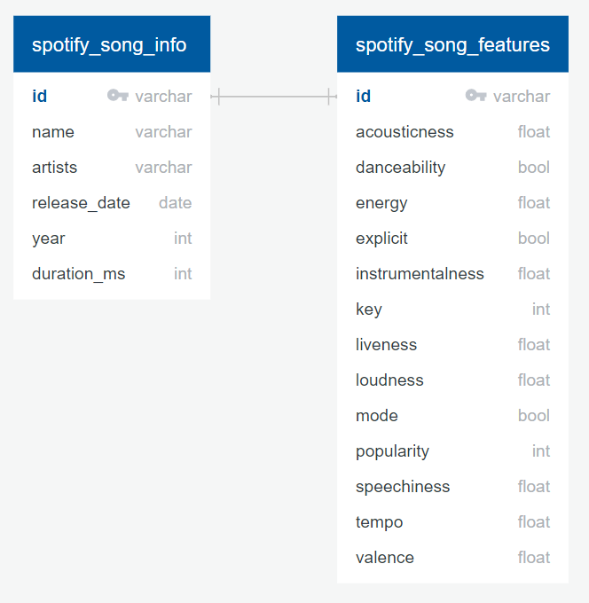

# Danceability-for-Spotify-Songs

## Team Members
* **Square**: Github Repository (Faith)
* **Triangle**: Machine Learning Model (Diana)
* **Circle**: Database Integration (Daniel)

## Communication Protocols: 
* Slack for quick and easy communication among team members
* Zoom meetings on Tuesday, Thursdays and Saturdays
* Additional meetings on other days if necessary

## Project Overview

### Topic: Danceability for Spotify Songs from 1921 to 2020

### Softwares Used
* Jupyter Notebook
* ERD (Entity Relationship Diagram) Tool
* Language (Python)

### Reasons for Selected Topic
* How machine learning can predict the danceability of a song using different factors.
* How machine learning can predict the danceability of a song

### Description of Dataset Source
* Dataset was downloaded from [Kaggle](https://www.kaggle.com/datasets/ektanegi/spotifydata-19212020) and captured the top 2000 songs on Spotify for each year from 1921 to 2020
* Columns include general song information and [song features](https://developer.spotify.com/documentation/web-api/reference/#/operations/get-audio-features) which contain audio feature information for each unique Spotify Id
* Data was collected from Spotify Web API 
* Dimension of Original Dataset: 169909 rows by 19 columns

### Questions we hope to answer
* Can machine learning models predict the danceability of Spotify songs using audio feature information?
* How has danceability changed throughout the years from 1921 to 2020?
* How danceable or energetic a song is?
* How various factors can predict the danceability of a song.

## Machine Learning Model

## Database
We plan to use a SQL database (PostgreSQL and pgAdmin) to store our data. Our dataset consists of two tables: *[spotify_song_info.csv](Resources/spotify_song_info.csv)* which contains general information about each song and *[spotify_song_features.csv](Resources/spotify_song_features.csv)* which contains feature columns that we plan to use in our machine learning model. *spotify_song_features.csv* also contains the target column, *danceability*, for our machine learning model. The two tables will be merged into one dataset, *[merged_spotify_songs.csv](Resources/merged_spotify_songs.csv)*, using SQL and will be cleaned using the Python Pandas library.  

The Entity Relationship Diagram for the two tables is shown below:  

